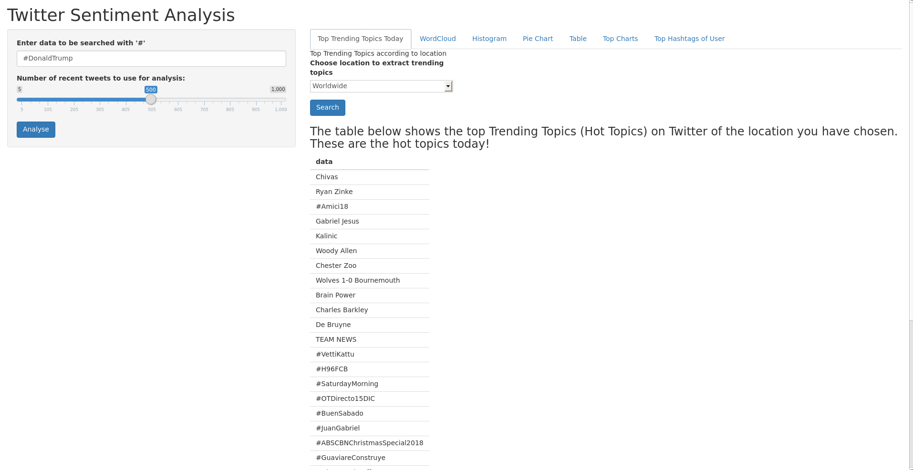
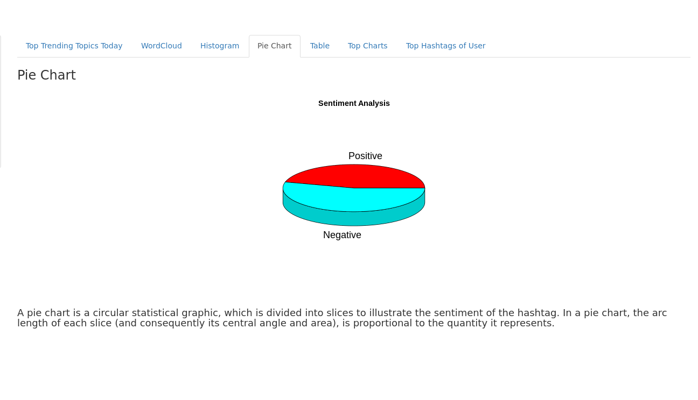
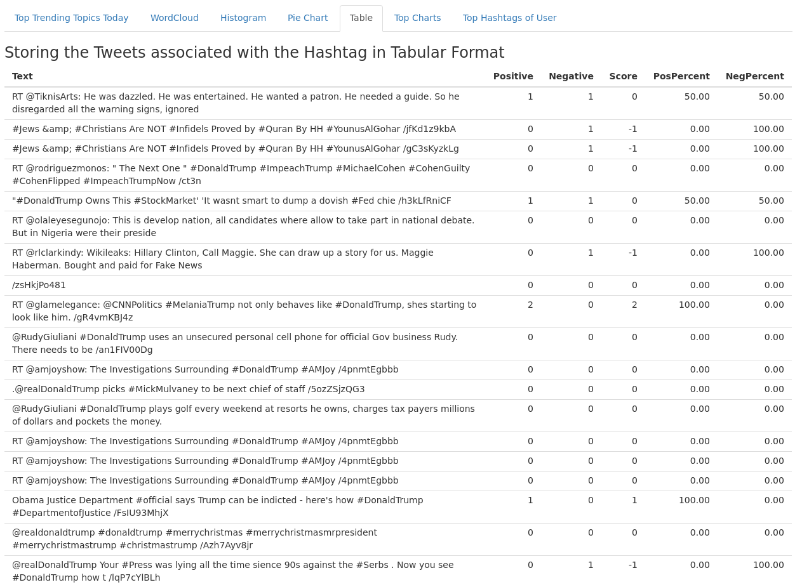
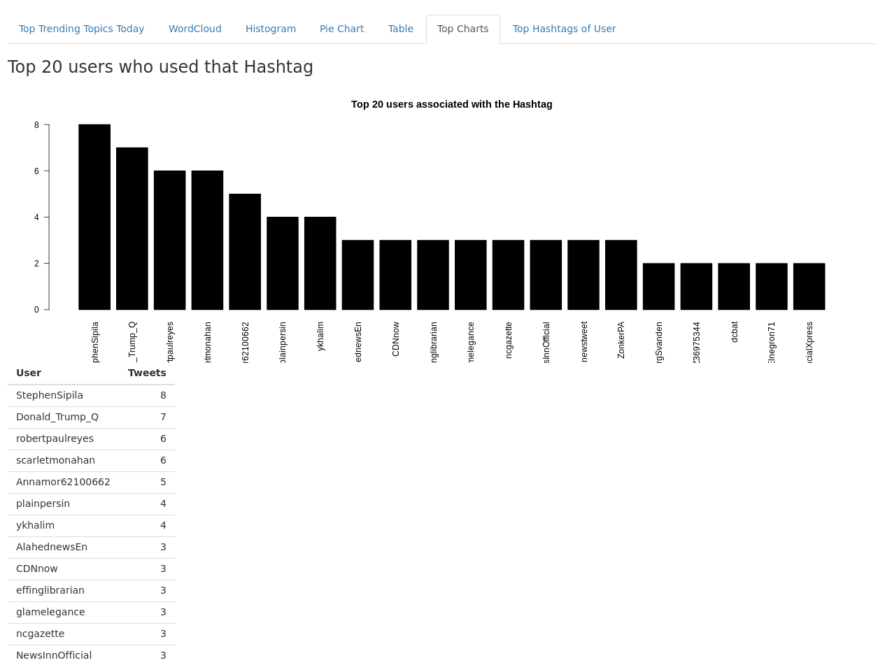

# Twitter Sentiment Analysis using R & Shiny WebApp
A Simple Approach to Twitter Sentiment Analysis in R Programming Language

   This project is on “Twitter Sentiment Analysis using R”
is a sentiment analysis project based on big data analytics. This
project will help us to analyze sentiment from Twitter generated
text data. Which will be able to show the sentimental state for a
person or a specific topic or whatever we want.

  The aim for this project is to build up an application which
will be able to connect nontechnical people to the field of data
mining. Where using simple user interface they will be able to
create a report based on their search keyword. This application
is very simple and easy to use. So it will be comfortable for
everyone to use it.
   
# Shiny

 This project was built using [Shiny WebApp](https://shiny.rstudio.com/). Shiny is an R package that makes it easy to build interactive web apps straight from R. You can host standalone apps on a webpage or embed them in R Markdown documents or build dashboards. You can also extend your Shiny apps with CSS themes, htmlwidgets, and JavaScript actions.
 
**In Shiny App, there are 2 types of creating GUI Based Web Applications :**
1) ```Single-file``` (app.R)
2) ```Multi-file``` (ui.R,server.R)

This project is ```Multi-file``` type, which contains 2 separate files for Front-End & Back-End Development.
```ui.R``` is for Front-End & ```server.R``` is for Back-End.
# Prerequisites

Prerequisites for this project are :

```
Twitter API
R Binary
An IDE for R Programming (RStudio)
Shiny & Plotrix (R Libraries)
Positive & Negative Words List (To compare Tweets for Sentiment)
```
## Steps to execute this program are :

* **Create a Twitter Developer account [here](https://developer.twitter.com/). After your Developer Account gets approved, [create a Twitter App](https://developer.twitter.com/en/apps/create).** 
* **After creating a Twitter App you will get Twitter API keys, now in RStudio open server.R file & replace "XXXXXXXXX" with appropriate API keys.**
* **Now execute this script, using "Run App" button provided in the above section of RStudio.**
* **Once you execute the script, you will get an interactive dashboard to analyze Sentiment Analysis of Twitter Data.**
* **Once your run the ui.R/server.R script, it will show the following dashboard which will be interactive:**

**1. Search input & Location Selection (By default location is set to Worldwide)**




**2. Word Cloud Formation**


**3. Plotting Histogram of Sentiments**


**4. Pie Chart for Sentiment Percentage**



**5. Table of Analyzed Tweets associated with the searched Hashtag**



**6. Barplot of Top 20 Users who used that Hashtag**



**7. Twitter Handle Analysis (Hashtag Frequencies by a particular User)**


## Contributors

* **Ankit Pandey** - *Initial work* - [ankit2web](https://github.com/ankit2web)
